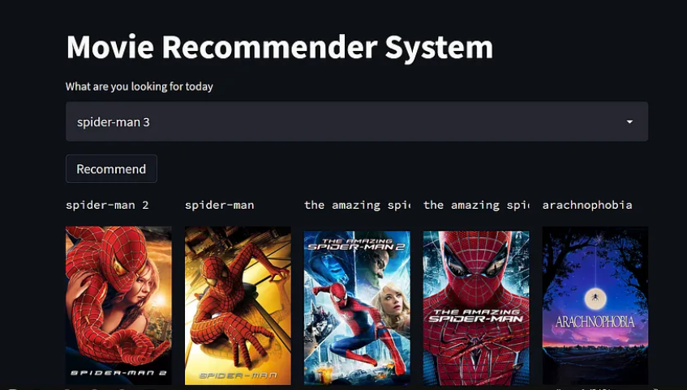

# Recommendation System

## 📌 Overview  
This project implements a **Recommendation System** using **machine learning** techniques. It suggests relevant items to users based on past interactions, improving user experience in applications like e-commerce, streaming platforms, and online learning.

## 📂Dataset  
The dataset consists of:  
- User interactions (ratings, purchases, or clicks).  
- Item details (features, categories, or metadata).  
- User profiles.

## 🔍Key Highlights:
- ✅ Feature Engineering: Extracted and processed metadata (genres, keywords, cast, director) 
      to build meaningful feature vectors.
- ✅ Similarity Computation: Applied cosine similarity to compare movies based on metadata.
- ✅ Optimized Retrieval: Efficiently searched for similar movies using a precomputed 
      similarity matrix.

## 📌Tech Stack & Tools Used:
- 🛠 Programming: Python, Pandas, NumPy, Sklearn
- 📂 Dataset: TMDB 5000 Movies & Credits
- 📊 Methodology: Content-based filtering with cosine similarity

## 🚀Features  
- **Data Preprocessing**: Handling missing values, encoding, and normalizing data.  
- **Exploratory Data Analysis (EDA)**: Visualizing user-item relationships.  
- **Collaborative Filtering**: User-based & Item-based recommendation algorithms.  
- **Content-Based Filtering**: Recommending items based on item attributes.  
- **Hybrid Model**: Combining both approaches for better accuracy.

## Next Steps & Improvements
🚀 Hybrid Model: Combine content-based and collaborative filtering for better recommendations.
🔍 Better Feature Engineering: Include movie descriptions, reviews, or plot summaries.
⚡ Deployment: Build an interactive web app using Flask or Streamlit.

💡 What’s your go-to recommendation technique? I would love to hear your thoughts on improving this further! 🚀

## 📊Results & Evaluation
- Generated personalized recommendations for users.
- Different recommendation algorithms were compared using evaluation metrics.
- Visualized insights from user-item interactions.
